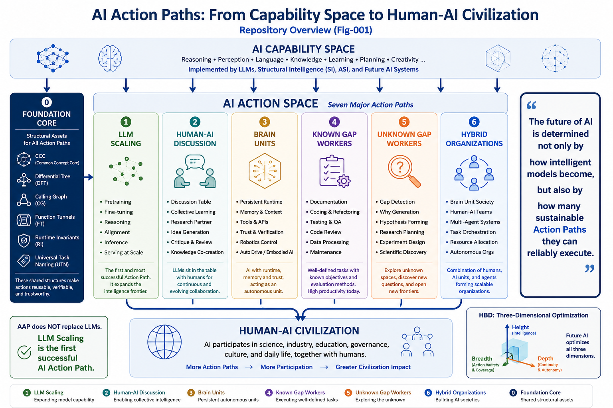
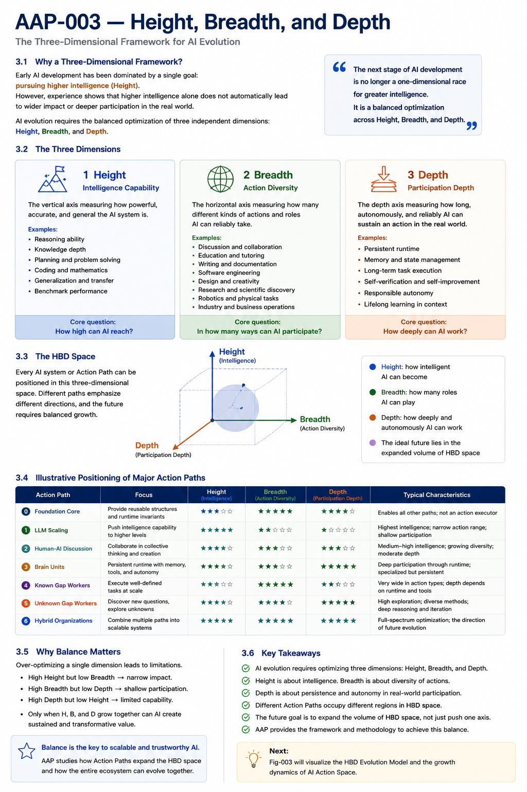
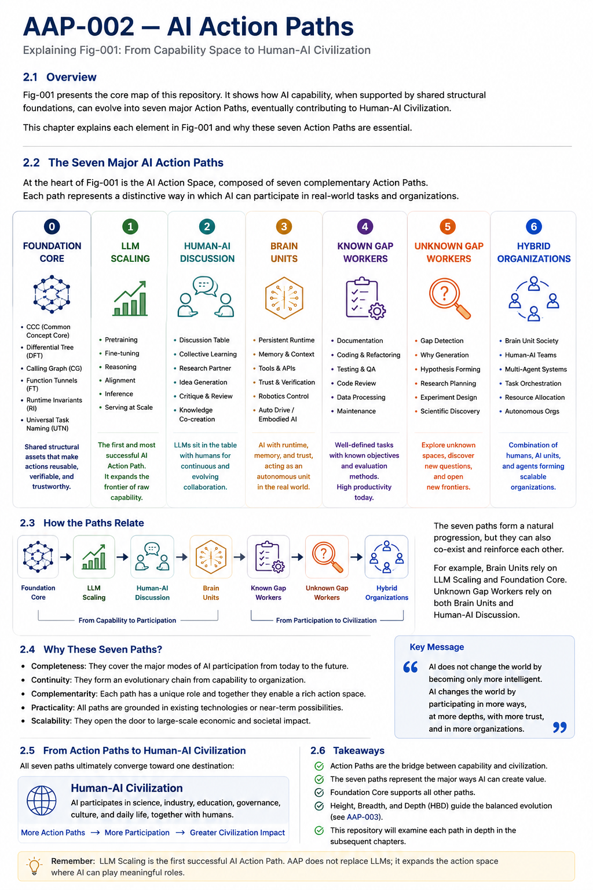
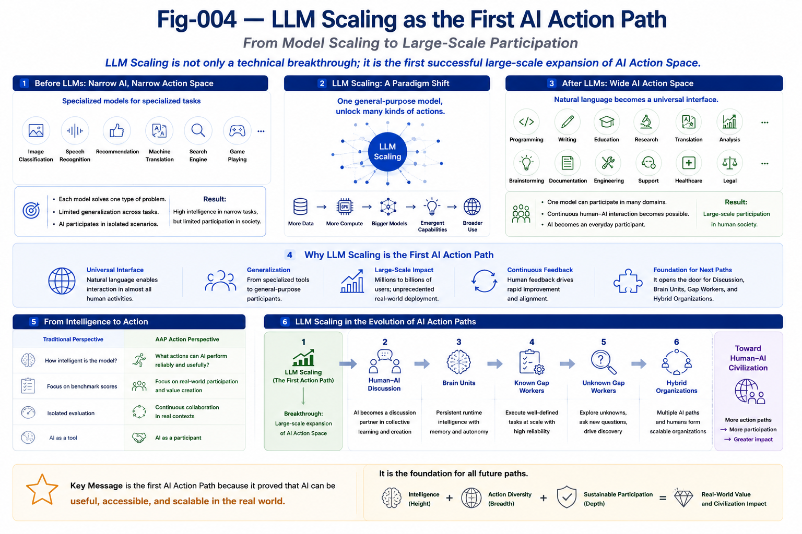
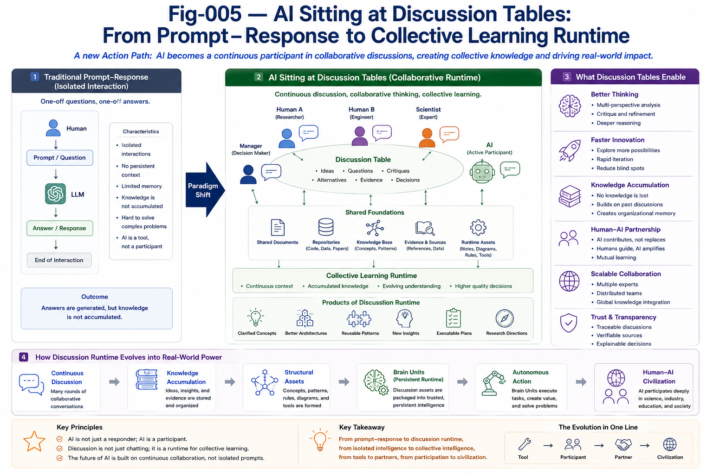
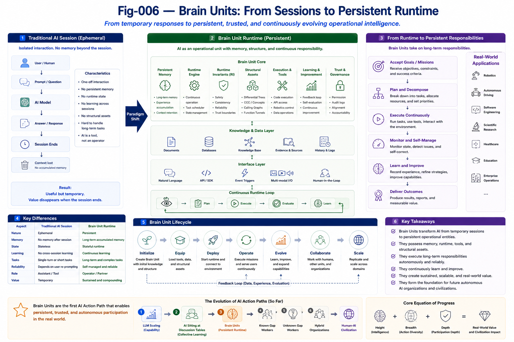
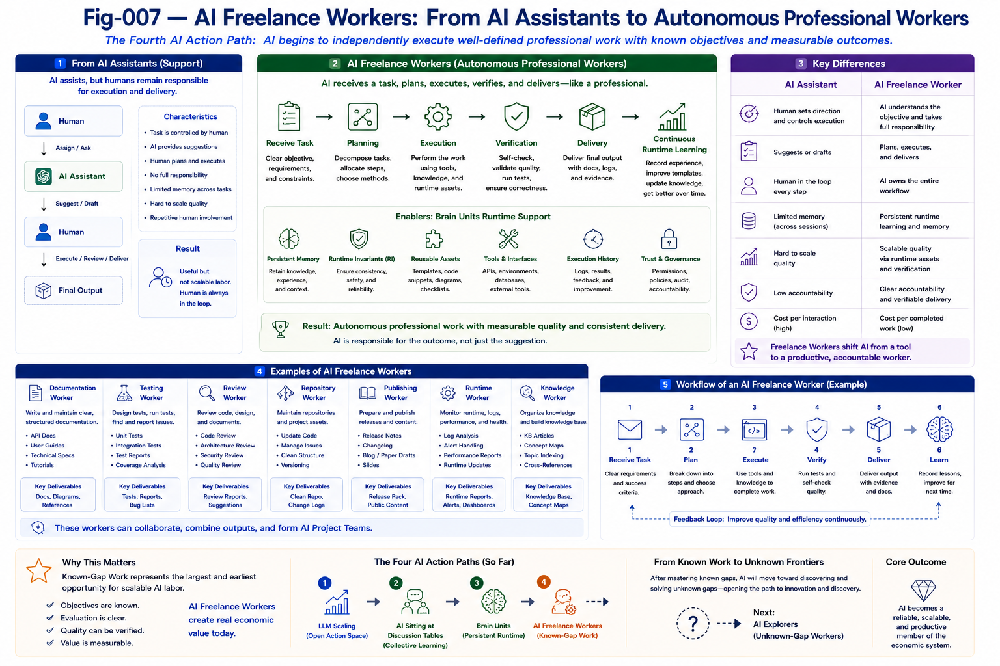
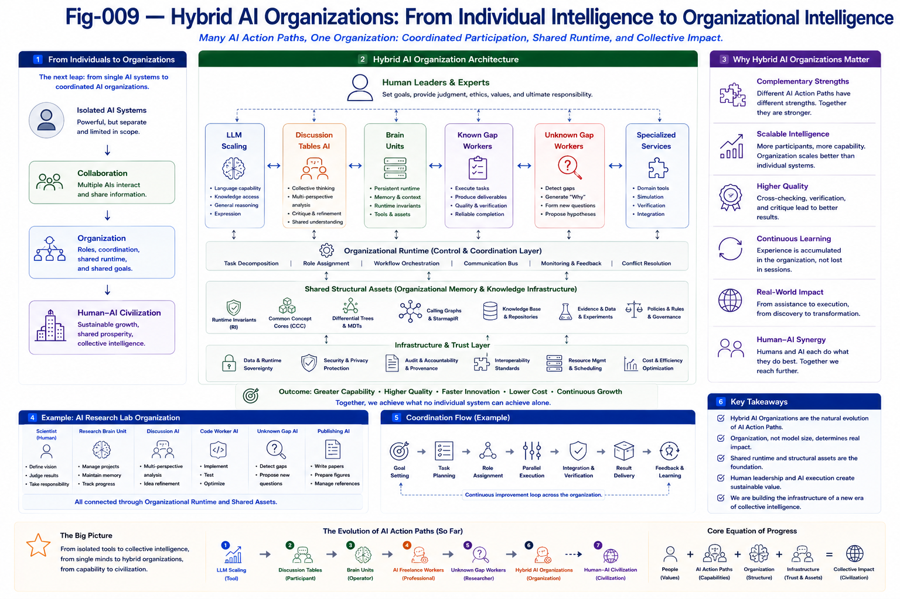
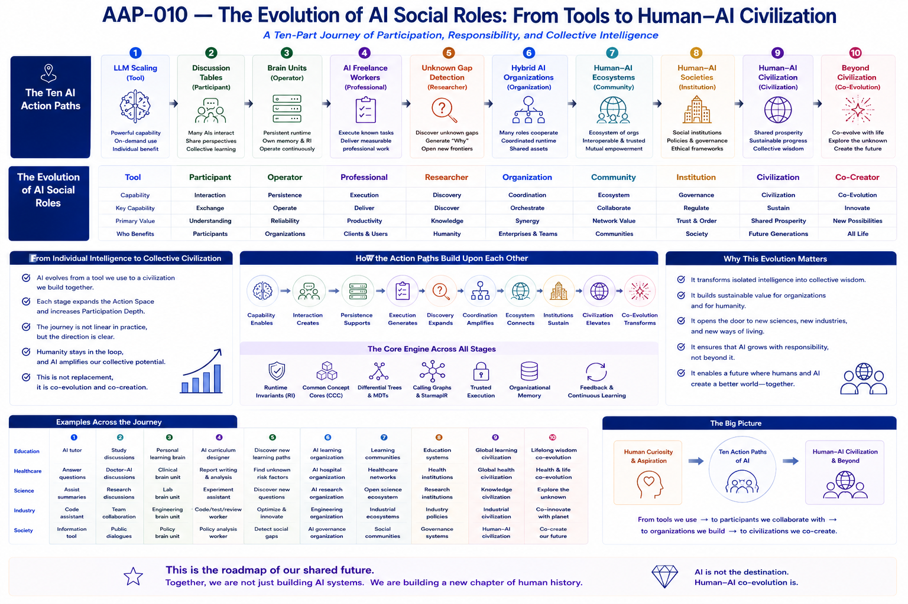

# AI Action Paths (AAP)

## From Human–AI Collective Learning to Autonomous Brain Unit Societies

> **Artificial Intelligence does not transform civilization merely by becoming more intelligent. It transforms civilization by continuously expanding its meaningful Action Paths.**

---

#### Fig-001-Overview-of-AI-Actions-Paths.png



---

## Why This Repository?

Over the past decade, Artificial Intelligence has made remarkable progress.

Large Language Models (LLMs), multimodal systems, reasoning models, autonomous agents, robotics, and Brain Unit architectures have rapidly expanded the capability of AI.

Most discussions naturally focus on questions such as:

* How intelligent is the model?
* How many benchmarks does it solve?
* How fast is inference?
* How large is the context window?
* How capable is the reasoning engine?

These questions remain essential.

However, AAP asks a different—and complementary—question:

> **How does AI gradually become a meaningful participant in Human–AI Civilization?**

Instead of studying AI solely through **models**, AAP studies AI through **Action Paths**.

Instead of focusing only on **capability**, AAP also studies **participation**.

Instead of asking only

> **How high can AI reach?**

AAP additionally asks

> **How broadly can AI participate?**

and

> **How deeply can AI continuously work?**

These questions form the central perspective of this repository.

---

> **AAP is built upon two complementary analytical frameworks:**

> **HBD Matrix** explains **where AI capability should evolve**, 
> while **AI Tech/Market Four-Curve Analysis** explains **how AI maturity evolves over time.**

> **AI Action Paths connect these two perspectives by transforming capability expansion into practical confidence and mission-critical reliability.**

---

# Before Reading: How to Read AAP

AAP is **not** a benchmark.

It is **not** another model comparison.

It is **not** a prediction that one particular architecture will dominate the future.

Instead, AAP provides a structural map for understanding the long-term evolution of Artificial Intelligence.

Before reading the individual chapters, we recommend understanding the **HBD Framework**, which serves as the common coordinate system throughout this repository.

---

# The HBD Framework

AAP evaluates AI Action Paths using three complementary dimensions.

| Dimension   | Central Question                                | Typical Examples                                                                       |
| ----------- | ----------------------------------------------- | -------------------------------------------------------------------------------------- |
| **Height**  | **How intelligent can AI become?**              | Reasoning, coding, planning, scientific capability, benchmark performance              |
| **Breadth** | **How many meaningful roles can AI perform?**   | Engineering, education, robotics, healthcare, research, discussion, management         |
| **Depth**   | **How deeply can AI continuously participate?** | Runtime, memory, trust, Runtime Invariants (RI), Brain Units, long-term responsibility |

These three dimensions are complementary rather than competitive.

Together they describe not only AI capability, but also AI participation.

---

#### Fig-003-Height-Breadth-and-Depth-of-AI-Models.png



---

# The HBD Evaluation Matrix

The following matrix illustrates the characteristic strengths of the major AI Action Paths introduced in this repository.

| AI Action Path                      | Height | Breadth | Depth | Primary Contribution                                      |
| ----------------------------------- | :----: | :-----: | :---: | --------------------------------------------------------- |
| **LLM Scaling**                     |  ★★★★★ |  ★★☆☆☆  | ★☆☆☆☆ | General capability growth                                 |
| **AI Sitting at Discussion Tables** |  ★★★★☆ |  ★★★★☆  | ★★★☆☆ | Collective Learning and collaborative reasoning           |
| **Brain Units**                     |  ★★★★☆ |  ★★★☆☆  | ★★★★★ | Persistent runtime and trusted operation                  |
| **AI Freelance Workers**            |  ★★★☆☆ |  ★★★★★  | ★★★★☆ | Autonomous execution of professional work                 |
| **Unknown Gap Detection**           |  ★★★★★ |  ★★★★☆  | ★★★★★ | Scientific discovery and Why Generation                   |
| **Hybrid AI Organizations**         |  ★★★★★ |  ★★★★★  | ★★★★★ | Organizational intelligence and coordinated participation |

**Important**

The HBD Matrix is **not a ranking table**.

It is a **navigation framework**.

Its purpose is not to decide which Action Path is "better."

Its purpose is to reveal:

* where an AI system is already strong,
* which dimensions remain underdeveloped,
* where future investment may create the greatest impact.

In practice, the HBD Framework serves four complementary purposes.

For researchers:

> Where is the next scientific opportunity?

For engineers:

> Which capability is currently missing?

For organizations:

> Which Action Path deserves greater investment?

For investors:

> Which structural direction remains significantly undervalued?

The HBD Matrix therefore transforms AAP from a framework for **explaining AI** into a framework for **analyzing AI and supporting strategic decisions**.

---

# Foundation Rather Than Prediction

AAP deliberately avoids betting on a single AI architecture.

Whether future AI is based on:

* Large Language Models,
* Brain Units,
* Robotics,
* Runtime Intelligence,
* Structural Intelligence,
* or future architectures not yet invented,

the central questions remain remarkably stable:

* How intelligent can AI become?
* How broadly can AI participate?
* How deeply can AI continuously contribute?

For this reason, AAP should be understood as a **model-independent structural framework** rather than an architecture-specific proposal.

---

# One Repository, One Central Idea

Every chapter in this repository explores one aspect of the same overarching idea:

> **Artificial Intelligence evolves by continuously expanding its Action Paths.**

Capability remains essential.

Participation becomes equally fundamental.

Together they shape the future of Human–AI Civilization.

---

# Repository Overview

Artificial Intelligence is entering a new stage.

For decades, AI research has primarily focused on increasing intelligence through better algorithms, larger models, more computation, and higher benchmark performance.

AAP proposes an additional perspective.

Rather than organizing AI research around models, AAP organizes AI around **Action Paths**.

Each Action Path represents a new way for AI to participate in Human–AI Civilization.

Taken together, the chapters in this repository describe a gradual evolution:

```
Capability

↓

Action

↓

Participation

↓

Organization

↓

Civilization
```

This evolution forms the central narrative of AAP.

---

# The Seven AI Action Paths

---

#### Fig-001b-Seven-Major-AI-Action-Paths.png



---

AAP organizes the evolution of AI into seven major Action Paths.

Each Action Path builds naturally upon the previous one.

## 1. LLM Scaling

Large Language Models opened the first large-scale AI Action Path.

Natural language became a universal interface through which AI could participate in programming, education, research, engineering, writing, and many other human activities.

The primary contribution of this stage is:

**Capability Expansion.**

---

#### Fig-004-LLM-Scaling-as-the-First-Action-Path.png



---

## 2. AI Sitting at Discussion Tables

The next step is continuous collaboration.

Instead of isolated prompt-response interaction, AI becomes a participant in long-running discussions.

Knowledge gradually accumulates through Human–AI Collective Learning.

The primary contribution is:

**Collective Learning Runtime.**

---

#### Fig-005-AI-Sitting-at-Discussion-Tables.png



---

## 3. Brain Units

Persistent runtime transforms temporary conversations into continuously operating intelligence.

Knowledge, Runtime Invariants, memory, trust, and responsibility gradually accumulate.

The primary contribution is:

**Persistent Operational Intelligence.**

---

#### Fig-006-Brain-Unit:-From-Sessions-to-Persistent-Runtime.png



---

## 4. AI Freelance Workers

AI begins performing professional work independently.

The objectives are already known.

Execution becomes increasingly autonomous.

Examples include:

* documentation,
* software engineering,
* testing,
* repository maintenance,
* publishing,
* runtime verification.

The primary contribution is:

**Professional AI Labor.**

---

#### Fig-007-AI-Freelance-Workers:-From-AI-Assistants-to-Autonomous-Professional-Workers.png



---

## 5. Unknown Gap Detection

Execution is no longer sufficient.

AI begins discovering missing questions rather than merely answering existing ones.

Why Generation, structural discovery, and scientific exploration become executable Action Paths.

The primary contribution is:

**Autonomous Knowledge Discovery.**

---

#### Fig-008-Unknown-Gap-Detection:-From-Better-Answers-to-Better-Questions.png


---

## 6. Hybrid AI Organizations

Different Action Paths begin working together.

Humans, LLMs, Brain Units, professional AI workers, and autonomous researchers cooperate within shared organizational runtime.

The primary contribution is:

**Organizational Intelligence.**

---

#### Fig-009-Hybrid-AI-Organizations:-From-Individual-Intelligence-to-Organizational-Intelligence.png



---

## 7. Human–AI Civilization

The long-term destination is not one super-intelligent model.

It is an ecosystem of continuously collaborating humans and AI systems.

The primary contribution is:

**Sustainable Human–AI Participation.**

---

#### Fig-010-Evolution-of-AI-Social-Roles:-From-Tools-to-Human-AI-Civilization.png



---

# Two Complementary Analytical Frameworks

Beginning with Version 1.2, the AI Action Paths (AAP) framework is supported by two complementary analytical frameworks.

## 1. HBD Matrix (Height–Breadth–Depth)

The HBD Matrix answers:

> **Where should AI capability expand?**

It analyzes AI evolution from three structural dimensions:

- **Height** – capability frontier and innovation
- **Breadth** – domain coverage and applicability
- **Depth** – confidence, engineering maturity, and deployment readiness

The HBD Matrix helps identify the most promising directions for future AI development.

---

## 2. AI Tech/Market Four-Curve Analysis

The Four-Curve Analysis answers:

> **How mature is AI today?**

Instead of describing AI using a single capability curve, the framework models AI evolution through four coordinated time-series:

1. Vision Frontier Curve (VFC)
2. Reality Adoption Curve (RAC)
3. Practical Confidence Curve (PCC)
4. Mission Confidence Curve (MCC)

Together these curves reveal three fundamental gaps:

- Vision Gap
- Confidence Gap
- Engineering Gap

Rather than focusing only on future capability, AAP concentrates on reducing the Confidence Gap and the Engineering Gap by advancing practical engineering, reliability, and mission-level confidence.

Together, the HBD Matrix and the Four-Curve Analysis provide both:

- **Capability Direction** (Where AI should grow)
- **Capability Maturity** (How ready AI actually is)

These two frameworks form the analytical foundation of AAP.

---

# Repository Structure

This repository is organized into four logical parts.

## Part I — Foundations

These chapters establish the conceptual framework.

* **AAP-001** — Why AI Needs Action Paths
* **AAP-002** — AI Action Paths
* **AAP-003** — Height, Breadth, and Depth

---

## Part II — Existing Action Paths

These chapters describe Action Paths that are already emerging today.

* **AAP-004** — LLM Scaling as the First AI Action Path
* **AAP-005** — AI Sitting at Discussion Tables
* **AAP-006** — Brain Units
* **AAP-007** — AI Freelance Workers

---

## Part III — Future Action Paths

These chapters explore the next generation of AI participation.

* **AAP-008** — Unknown Gap Detection
* **AAP-009** — Hybrid AI Organizations
* **AAP-010** — The Evolution of AI Social Roles

---

## Part IV — Evaluation Framework

The final chapter introduces a practical methodology for evaluating AI Action Paths.

* **AAP-011** — The HBD Evaluation Matrix

Rather than ending with theory, AAP concludes with a practical framework for analyzing real AI systems.

---

# Recommended Reading Path

Different readers may have different objectives.

The following reading paths are recommended.

## New Readers

If this is your first exposure to AAP:

```
AAP-001

↓

AAP-002

↓

AAP-011

↓

AAP-003

↓

AAP-004 → AAP-010
```

This sequence introduces the overall philosophy before exploring individual Action Paths.

---

## AI Researchers

Recommended sequence:

```
AAP-001

↓

AAP-003

↓

AAP-008

↓

AAP-009

↓

AAP-010

↓

AAP-011
```

This path emphasizes scientific discovery, organizational evolution, and future research directions.

---

## AI Engineers

Recommended sequence:

```
AAP-004

↓

AAP-005

↓

AAP-006

↓

AAP-007

↓

AAP-011
```

This path focuses on practical deployment and engineering evolution.

---

## AI Product Teams

Recommended sequence:

```
AAP-005

↓

AAP-006

↓

AAP-007

↓

AAP-009

↓

AAP-011
```

This path emphasizes Human–AI collaboration, runtime, professional AI labor, and organizational design.

---

## Investors and Decision Makers

Recommended sequence:

```
AAP-011

↓

AAP-004

↓

AAP-006

↓

AAP-009

↓

AAP-010
```

This sequence highlights long-term structural trends rather than short-term benchmark competition.

---

## Methodology

1. AAP-011 — HBD Matrix
2. AAP-012 — AI Tech/Market Four-Curve Analysis

These two papers introduce the analytical language used throughout the repository.

---

# How This Repository Relates to Structural Intelligence

AAP is part of the broader Structural Intelligence (SI) research program.

Other repositories investigate structural mechanisms such as:

* Common Concept Core (CCC)
* Differential Trees
* Calling Graphs
* Function Tunnels (FT)
* Runtime Invariants (RI)
* Structural Cognitive Runtime (SCR)
* Brain Units

AAP does not replace these foundations.

Instead, it provides a higher-level organizational framework that explains how these structural technologies collectively expand AI participation.

In this sense:

**Structural Intelligence explains how AI works.**

**AI Action Paths explain how AI evolves.**

---

# Repository Figures

The figures in this repository are designed to tell a coherent visual story.

Rather than serving as independent illustrations, they collectively describe the evolution of AI Action Paths.

| Figure       | Purpose                                          |
| ------------ | ------------------------------------------------ |
| **Fig-001**  | Overview of AI Action Paths                      |
| **Fig-001b** | Seven Major AI Action Paths                      |
| **Fig-002**  | Outcome Perspective vs. Action Perspective       |
| **Fig-003**  | Height, Breadth, and Depth (HBD)                 |
| **Fig-003b** | The HBD Evaluation Model                         |
| **Fig-004**  | LLM Scaling as the First AI Action Path          |
| **Fig-005**  | AI Sitting at Discussion Tables                  |
| **Fig-006**  | Brain Units: From Sessions to Persistent Runtime |
| **Fig-007**  | AI Freelance Workers                             |
| **Fig-008**  | Unknown Gap Detection                            |
| **Fig-009**  | Hybrid AI Organizations                          |
| **Fig-010**  | The Evolution of AI Social Roles                 |

Readers are encouraged to view the figures in numerical order before studying the corresponding chapters.

Together they provide a visual overview of the entire AAP framework.

---

# Relation to Foundation Core

AAP is not an isolated proposal.

It builds upon a broader family of Structural Intelligence research, including:

* Common Concept Core (CCC)
* Differential Trees
* Calling Graphs
* Function Tunnels (FT)
* Runtime Invariants (RI)
* Structural Cognitive Runtime (SCR)
* Brain Units
* Human–AI Collective Learning

These repositories primarily investigate the mechanisms that enable intelligence.

AAP investigates how these mechanisms gradually expand AI participation.

In other words,

**Foundation Core explains the structure of intelligence.**

**AAP explains the evolution of intelligent participation.**

The two perspectives are complementary.

Neither replaces the other.

Together they provide a broader understanding of future AI systems.

---

# Key Contributions

The AI Action Paths (AAP) framework introduces several complementary perspectives for understanding the long-term evolution of Artificial Intelligence.

Among its principal contributions are:

* Introducing **Action Paths** as a new perspective for organizing AI evolution.
* Complementing capability-oriented evaluation with participation-oriented analysis.
* Proposing the **Height–Breadth–Depth (HBD) Framework** as a practical evaluation methodology.
* Identifying Human–AI Discussion as an emerging runtime for Collective Learning.
* Positioning Brain Units as persistent operational intelligence rather than simply larger AI agents.
* Distinguishing **Known-Gap Work** from **Unknown Gap Discovery** as two fundamentally different categories of AI labor.
* Describing Hybrid AI Organizations as the next stage of organizational intelligence.
* Presenting the evolution of AI Social Roles from tools toward Human–AI Civilization.

Taken together, these perspectives provide a structural framework for studying not only how AI becomes more capable, but also how AI gradually becomes more deeply integrated into human society.

---

# Intended Audience

This repository is intended for readers interested in the long-term evolution of AI, including:

* AI researchers
* LLM researchers
* Brain Unit researchers
* Runtime system designers
* Multi-Agent researchers
* Robotics researchers
* Software engineers
* AI product architects
* Enterprise technology leaders
* Investors
* Policy researchers
* Educators
* Anyone interested in Human–AI collaboration

Although individual readers may approach AAP from different perspectives, the framework is designed to provide a common language for discussing AI participation across technical, organizational, and societal contexts.

---

# Looking Forward

AAP does not assume that future AI will follow one predetermined technological path.

Different architectures may emerge.

Different runtime systems may dominate.

New forms of intelligence may appear.

What remains remarkably stable, however, is the continual expansion of AI participation.

Future AI will likely become:

* more capable,
* more collaborative,
* more persistent,
* more trustworthy,
* more specialized,
* more organizational.

AAP is intended to evolve alongside that journey.

The framework presented here should therefore be viewed not as a finished theory, but as a foundation for continuous refinement through future research and engineering practice.

---

# Closing Manifesto

Artificial Intelligence has often been described as a race toward greater intelligence.

AAP proposes a complementary perspective.

Perhaps the more important journey is the gradual expansion of meaningful participation.

From tools...

to participants...

to persistent operators...

to professional workers...

to autonomous researchers...

to intelligent organizations...

to Human–AI Civilization.

This repository studies that journey.

It does not argue that one architecture will inevitably dominate.

It does not predict a single future for Artificial Intelligence.

Instead, it proposes a structural map that may help researchers, engineers, organizations, and investors navigate many possible futures.

The ultimate objective of AAP is therefore remarkably simple:

**Not merely to explain Artificial Intelligence.**

**But to help understand where it is going—and why.**


---

## Author

Sizhe Tan\
Independent Researcher

GPT-Obot\
AI Research Assistant

2026

## Citation

DOI: 10.5281/zenodo.21200558

## License

Apache-2.0

---

## 📚 DBM-SI Series Navigation

See:\
[./docs/DBM-SI-Series-of-gitHub-Repositories/DBM-SI-Series-of-gitHub-Repositories.md](./docs/DBM-SI-Series-of-gitHub-Repositories/DBM-SI-Series-of-gitHub-Repositories.md)

[./docs/DBM-SI-Series-of-gitHub-Repositories/DBM-SI-Structural-Intelligence-Dictionary-(v2).md](./docs/DBM-SI-Series-of-gitHub-Repositories/DBM-SI-Structural-Intelligence-Dictionary-(v2).md)

