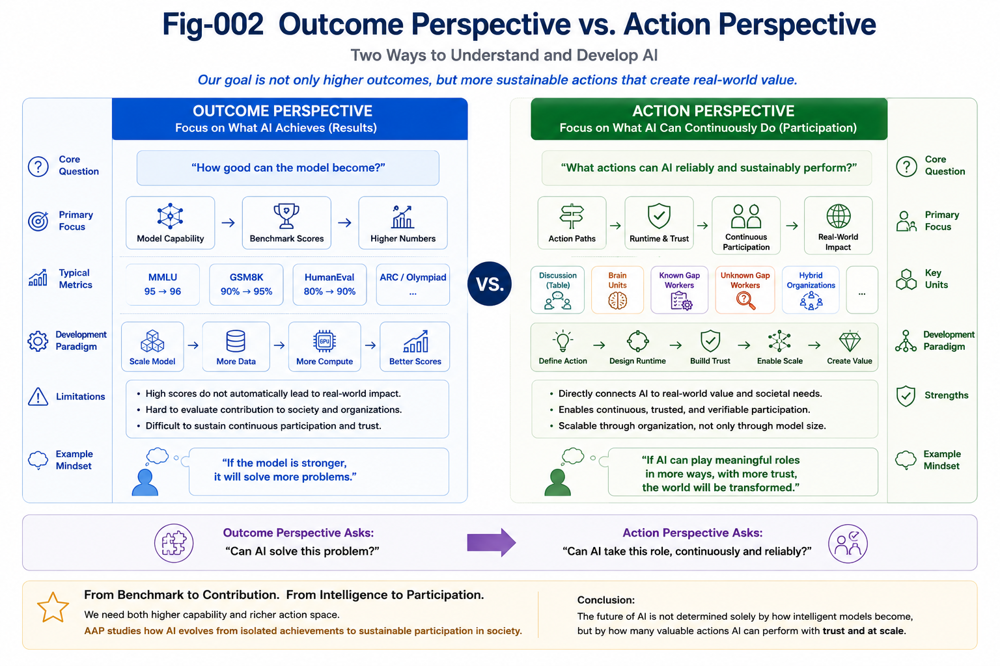

# AAP-002 — AI Action Paths

## Explaining Fig-001: From Capability Space to Human–AI Civilization

---

## Abstract

Figure 001 presents the conceptual map of this repository.

It illustrates a central idea of AAP:

> **Artificial intelligence evolves not only by becoming more capable, but also by acquiring increasingly rich and sustainable Action Paths.**

Rather than viewing AI solely through model architectures or benchmark scores, AAP introduces **AI Action Space** as a complementary perspective. Different AI systems may implement different Action Paths, while sharing common structural foundations and collectively contributing to Human–AI Civilization.

This chapter explains the seven Action Paths shown in Fig-001 and their relationships.

---

# From Capability Space to Action Space

---

#### Fig-002-Outcome-Perspective-vs-Action-Perspective.png



---

Most discussions of artificial intelligence begin with models.

Examples include:

- Large Language Models (LLMs)
- Structural Intelligence (SI)
- Runtime Intelligence (RI)
- Brain Units
- Future Autonomous AI

These systems differ in architecture, implementation, and internal mechanisms.

AAP proposes that an equally important perspective is to classify AI by **what actions it can continuously perform**, rather than solely by how it is implemented.

This perspective transforms

```
Capability
```

into

```
Action
```

and ultimately into

```
Organization
```

and

```
Civilization.
```

Action Space therefore complements Capability Space rather than replacing it.

---

# The Seven Major AI Action Paths


---

#### Fig-001b-Seven-Major-AI-Action-Paths.png


---

Figure 001b organizes today's and tomorrow's AI evolution into seven major Action Paths.

Together they describe how intelligence gradually becomes productive, collaborative, trustworthy, and socially integrated.

---

## Foundation Core

Every sustainable Action Path requires reusable structural foundations.

Examples include:

- Runtime Invariants (RI)
- Calling Graphs
- Differential Trees
- Common Concept Cores (CCC)
- Function Tunnels (FT)
- Universal Task Naming (UTN)

These components provide repeatability, verification, runtime stability, and long-term accumulation.

Rather than representing a separate AI system, the Foundation Core supports every other Action Path.

---

## Path 1 — LLM Scaling

LLM Scaling is the first large-scale successful AI Action Path.

It demonstrates that increasing model capability dramatically expands the range of tasks AI can perform.

This repository explicitly considers LLM Scaling as an essential Action Path rather than an alternative to AAP.

AAP therefore builds upon, rather than competes with, the success of LLMs.

---

## Path 2 — Human–AI Discussion

The next Action Path begins when AI enters collaborative discussion.

Examples include:

- research discussions,
- software design,
- engineering planning,
- educational interaction,
- collective learning.

Here AI no longer acts only as an answer generator.

Instead, it becomes a continuous participant in human reasoning.

Human–AI Discussion represents the first runtime form of Collective Learning.

---

## Path 3 — Brain Units

Brain Units extend AI beyond individual conversations.

They introduce persistent runtime capabilities such as:

- trusted execution,
- memory,
- reusable knowledge,
- runtime invariants,
- continuous operation.

Typical applications include robotics, autonomous driving, medical systems, engineering assistants, and domain-specific AI services.

Brain Units transform AI from temporary interaction into long-lived operational systems.

---

## Path 4 — Known Gap Workers

Many real-world tasks already have well-defined objectives and evaluation methods.

Examples include:

- documentation,
- testing,
- code review,
- software maintenance,
- structured coding tasks,
- engineering support.

These tasks contain **Known Gaps**.

Their objectives are already understood.

The challenge is efficient execution.

Known Gap Workers therefore represent one of the earliest commercially scalable forms of autonomous AI labor.

---

## Path 5 — Unknown Gap Workers

Scientific discovery differs fundamentally from routine engineering.

The objective is often unknown.

The gap itself has not yet been identified.

This Action Path includes:

- Gap Detection,
- Why Generation,
- hypothesis formation,
- research planning,
- structural discovery.

Unknown Gap Workers move AI beyond task execution toward autonomous research.

---

## Path 6 — Hybrid Organizations

Future AI systems are unlikely to operate in isolation.

Instead, multiple specialized Action Paths will cooperate.

Examples include:

- Discussion AI,
- Brain Units,
- Research AI,
- Coding AI,
- Verification AI,
- Human experts.

Together they form scalable Human–AI organizations capable of solving increasingly complex problems.

Hybrid Organizations represent the transition from individual AI systems to AI societies.

---

# Relationships Among Action Paths

The seven Action Paths should not be interpreted as isolated categories.

They reinforce one another.

For example,

Brain Units may incorporate LLM Scaling, Runtime Invariants, and Human–AI Discussion.

Unknown Gap Workers rely heavily on Brain Units and Collective Learning.

Hybrid Organizations integrate nearly every Action Path.

AAP therefore describes an evolving ecosystem rather than a fixed hierarchy.

---

# Toward Human–AI Civilization

All Action Paths ultimately converge toward a common objective:

> increasing meaningful AI participation in science, engineering, education, healthcare, industry, governance, and daily life.

The long-term evolution is therefore not simply

```
More Intelligence
```

but

```
More Action

↓

More Participation

↓

More Civilization Impact
```

This shift from intelligence to participation is one of the central perspectives proposed by AAP.

---

# Relation to Existing AI Research

AAP does not replace existing AI paradigms.

Instead, it provides an organizational framework capable of accommodating multiple AI technologies.

Large Language Models remain the first successful large-scale Action Path.

Structural Intelligence provides reusable structural assets.

Runtime Intelligence contributes trusted execution.

Brain Units provide long-lived operational intelligence.

Future AI systems may combine these technologies to create increasingly diverse Action Spaces.

---

## Key Takeaways

- AI can be classified by executable Action Paths as well as by underlying models.
- Foundation Core supports every Action Path.
- LLM Scaling represents the first successful large-scale AI Action Path.
- Human–AI Discussion introduces Collective Learning.
- Brain Units enable persistent trusted runtimes.
- Known Gap Workers automate well-defined tasks.
- Unknown Gap Workers explore scientific discovery and new questions.
- Hybrid Organizations combine multiple Action Paths into scalable Human–AI systems.
- Human–AI Civilization emerges through expanding AI participation rather than model capability alone.