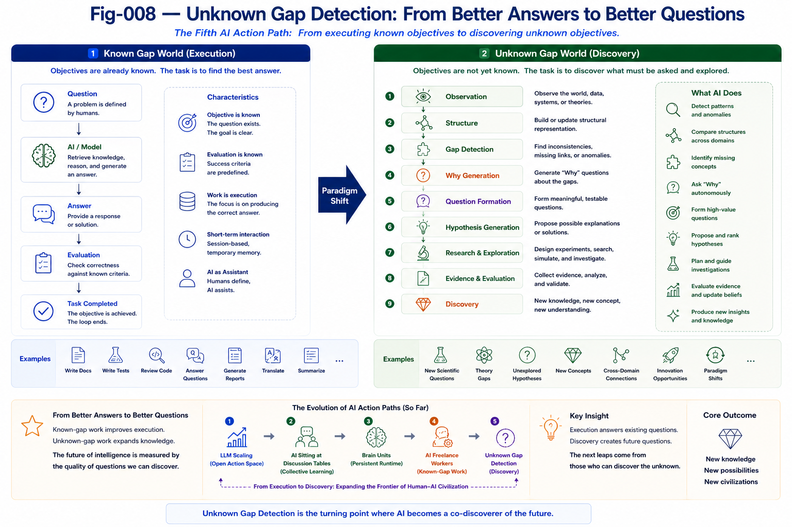

# AAP-008 — Unknown Gap Detection

## Toward Autonomous Discovery as the Fifth AI Action Path

---

## Abstract

Most current AI systems perform tasks whose objectives are already known.

The questions have been asked.

The requirements have been defined.

The evaluation criteria already exist.

AAP refers to this category as **Known-Gap Work**.

Scientific discovery, however, follows a fundamentally different process.

The most important problems often begin with questions that nobody has yet formulated.

The objective itself is unknown.

The gap has not yet been identified.

This chapter introduces **Unknown Gap Detection** as the next major AI Action Path.

Rather than executing predefined work, AI begins discovering new work.

This transition marks the beginning of autonomous scientific participation.

---

#### Fig-008-Unknown-Gap-Detection:-From-Better-Answers-to-Better-Questions.png

---

# From Execution to Discovery

Known-Gap Workers answer questions that already exist.

Unknown-Gap Workers ask questions that do not yet exist.

This distinction fundamentally changes the role of AI.

Instead of improving execution,

AI begins expanding humanity's knowledge frontier.

The central problem is no longer

> **How can AI solve this task?**

but

> **What task should exist next?**

---

# Known Objectives and Unknown Objectives

Known-Gap Work begins with a predefined objective.

Typical examples include:

- writing documentation,
- generating tests,
- reviewing code,
- maintaining repositories,
- preparing reports.

Unknown-Gap Work begins differently.

Neither the objective nor the solution is fully known.

Examples include:

- discovering new scientific questions,
- identifying structural inconsistencies,
- proposing new research directions,
- finding missing concepts,
- recognizing unexplored opportunities.

The objective itself becomes the discovery.

---

# Why Discovery Matters

Throughout scientific history, major advances rarely began with better execution.

They began with better questions.

Discovery therefore represents a higher level of intelligence than task completion alone.

Unknown Gap Detection transforms AI from a problem solver into a problem finder.

This represents a qualitative expansion of AI Action Space.

---

# Why Generation

Unknown Gap Detection naturally produces Why Generation.

As AI encounters structural inconsistencies, incomplete explanations, or unexplored relationships, new questions emerge.

Examples include:

- Why does this inconsistency exist?
- Why has this region remained unexplored?
- Why does this assumption fail?
- Why are these concepts disconnected?
- Why has no existing method solved this problem?

Questions therefore become generated rather than supplied.

This capability forms one of the foundations of autonomous scientific research.

---

# Structural Discovery

AAP views discovery as an organizational process rather than a single algorithm.

Future AI systems may continuously explore:

- conceptual gaps,
- runtime inconsistencies,
- missing structural assets,
- incomplete Calling Graphs,
- Differential Tree extensions,
- unexplored Function Tunnels,
- missing Runtime Invariants.

Each discovery expands Action Space rather than merely improving existing execution.

---

# Relation to Brain Units

Persistent Brain Units significantly increase the probability of discovering Unknown Gaps.

Long-term runtime enables:

- accumulated observations,
- continuous comparison,
- historical reasoning,
- organizational memory,
- iterative refinement.

Unknown Gap Detection therefore becomes increasingly powerful as runtime grows.

Discussion Tables create knowledge.

Brain Units preserve knowledge.

Unknown Gap Workers discover new knowledge.

Together they form a continuous evolutionary cycle.

---

# Relation to HBD Evolution

Unknown Gap Detection contributes strongly to all three HBD dimensions.

Height expands through advanced reasoning.

Breadth expands because AI participates in scientific discovery rather than only engineering execution.

Depth expands because long-running Brain Units continuously accumulate evidence before proposing new directions.

Among all Action Paths described in AAP, Unknown Gap Detection represents one of the largest future opportunities.

---

# Toward Autonomous Researchers

Unknown Gap Detection does not imply fully autonomous science overnight.

Instead, it introduces a gradual evolution.

AI may initially discover:

- candidate questions,
- unexplored hypotheses,
- structural inconsistencies,
- missing experiments.

Human researchers continue guiding evaluation and validation.

Over time, the discovery process itself becomes increasingly autonomous.

Autonomous research therefore emerges progressively rather than suddenly.

---

# The Fifth AI Action Path

From the perspective of AAP, Unknown Gap Detection represents the first Action Path whose primary product is not an answer.

Its primary product is a better question.

This transition changes AI from an executor of knowledge into a generator of future knowledge.

It therefore represents another major expansion of Human–AI Civilization.

---

## Key Takeaways

- Unknown Gap Detection represents the fifth AI Action Path.
- Discovery differs fundamentally from execution.
- Unknown Objectives define future scientific exploration.
- Better questions often create greater breakthroughs than better answers.
- Why Generation naturally emerges from structural discovery.
- Persistent Brain Units greatly enhance discovery capability.
- Unknown Gap Workers gradually evolve toward autonomous scientific participation.
- Future AI expands civilization by continuously discovering new Action Paths rather than only executing existing ones.