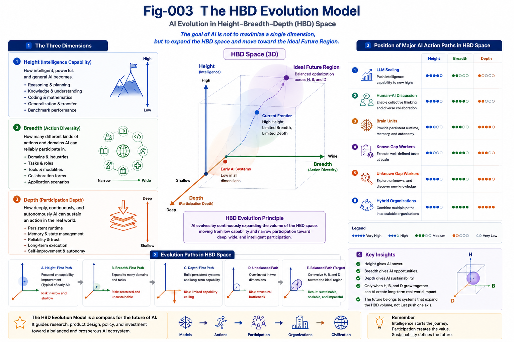

# AAP-011 — The HBD Evaluation Matrix

## From Explaining AI to Navigating AI

---

## Abstract

Most AI frameworks explain how artificial intelligence works.

AAP proposes one additional objective:

**helping researchers, engineers, companies, and investors understand where AI is heading.**

The HBD Evaluation Matrix is therefore not designed as another benchmark.

It is a navigation framework.

Rather than asking

> **Who has the best model?**

it asks

> **Where does this AI system stand today?**

and

> **What direction is likely to matter next?**

The objective is not ranking.

The objective is orientation.

---

#### Fig-003b-The-HBD-Evaluation-Model.png

---

# Every AI Journey Needs a Map

Imagine standing on top of a mountain overlooking the entire AI landscape.

Below are:

- Large Language Models
- Brain Units
- Robotics
- AI Agents
- Scientific AI
- Education AI
- Enterprise AI

Everyone is moving.

Everyone is making progress.

The difficult question is no longer

> **Who is moving?**

The difficult question is

> **In which direction?**

AAP proposes that the HBD Framework provides one possible map for answering this question.

---

# Three Questions

The HBD Framework reduces AI evaluation to three surprisingly practical questions.

## Height

**How intelligent can this AI become?**

Examples include:

- reasoning,
- coding,
- planning,
- scientific capability,
- benchmark performance.

---

## Breadth

**How many meaningful roles can this AI perform?**

Examples include:

- engineering,
- education,
- healthcare,
- robotics,
- discussion,
- management,
- scientific collaboration.

---

## Depth

**How deeply can this AI continuously participate?**

Examples include:

- persistent runtime,
- memory,
- trust,
- Runtime Invariants,
- long-term responsibility,
- organizational integration.

Together these three dimensions provide a practical description of AI participation.

---

# Reading the AI Landscape

The HBD Matrix is intended to be read much like a topographic map.

Different AI Action Paths naturally emphasize different dimensions.

| AI Action Path | Height | Breadth | Depth | Primary Strength |
|----------------|:------:|:--------:|:------:|------------------|
| **LLM Scaling** | ★★★★★ | ★★☆☆☆ | ★☆☆☆☆ | Capability growth |
| **AI Sitting at Discussion Tables** | ★★★★☆ | ★★★★☆ | ★★★☆☆ | Collective learning |
| **Brain Units** | ★★★★☆ | ★★★☆☆ | ★★★★★ | Persistent runtime |
| **AI Freelance Workers** | ★★★☆☆ | ★★★★★ | ★★★★☆ | Professional execution |
| **Unknown Gap Detection** | ★★★★★ | ★★★★☆ | ★★★★★ | Scientific discovery |
| **Hybrid AI Organizations** | ★★★★★ | ★★★★★ | ★★★★★ | Organizational intelligence |

The ratings are intentionally conceptual.

Their purpose is to visualize direction rather than calculate precise scores.

---

# Finding the Missing Dimension

One useful property of the HBD Framework is that it immediately highlights missing dimensions.

An AI system with exceptional Height but limited Breadth may need to expand into new application domains.

An organization with broad deployment but shallow Depth may benefit from persistent runtime, Brain Units, and Runtime Sovereignty.

A highly persistent system with insufficient Height may require stronger reasoning capabilities.

The framework therefore functions as a diagnostic tool rather than merely an evaluation tool.

---

# A Conversation Starter

The HBD Matrix is not intended to end discussions.

It is intended to begin better discussions.

Research groups may ask:

> Are we investing enough in Breadth?

Engineering teams may ask:

> Where is our weakest dimension?

Product leaders may ask:

> Which Action Path creates the greatest long-term value?

Investors may ask:

> Which capability is still structurally underdeveloped?

Different people will naturally reach different conclusions.

The important point is that everyone begins from the same map.

---

# Beyond Benchmark Thinking

Traditional AI evaluation often asks:

> Which model scores highest?

AAP asks another question:

> Which Action Path expands Human–AI participation the most?

These questions are complementary rather than competitive.

Capability remains indispensable.

Participation becomes equally important.

The HBD Framework therefore complements benchmark evaluation with organizational evaluation.

---

# Looking Forward

No evaluation framework remains perfect forever.

Neither does HBD.

Future AI systems may introduce entirely new Action Paths.

Additional dimensions may eventually become necessary.

The HBD Matrix is therefore intended as a living framework that evolves together with AI itself.

Its greatest value lies not in producing fixed scores, but in encouraging continuous structural thinking about AI evolution.

---

# Closing Remark

The purpose of the HBD Framework is remarkably simple.

When encountering a new AI technology, a new startup, a new research paper, or a new product, pause for a moment and ask three questions:

> **How high can it reach?**

> **How broadly can it participate?**

> **How deeply can it continuously work?**

Very often, these three questions reveal opportunities that benchmark scores alone cannot.

That is precisely the purpose of AAP.

Not merely to explain artificial intelligence,

but to help navigate its future.

---

## Key Takeaways

- The HBD Matrix is a navigation framework rather than a ranking system.
- Height measures capability.
- Breadth measures participation.
- Depth measures sustainable operation.
- Different AI Action Paths naturally emphasize different dimensions.
- Missing dimensions often reveal the next opportunity for growth.
- The framework supports researchers, engineers, organizations, and investors alike.
- AAP extends AI evaluation from explaining intelligence toward guiding long-term strategic decisions.