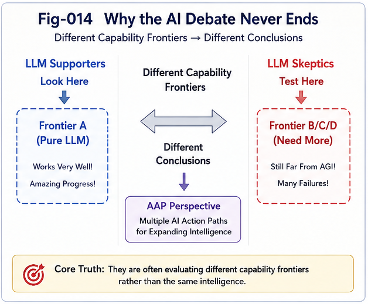
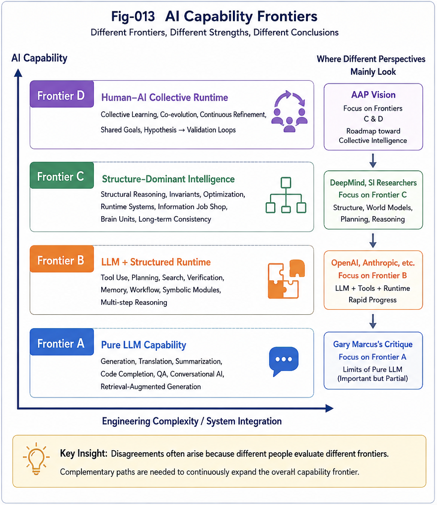
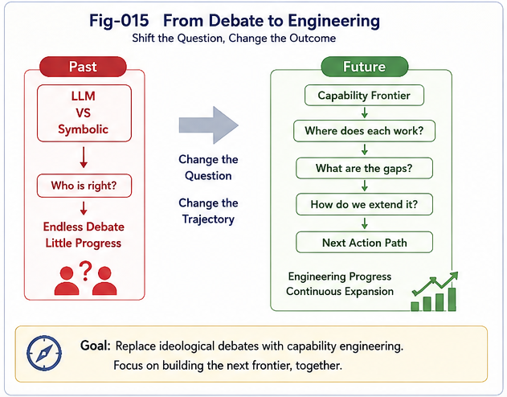

# AAP-013 — Beyond the LLM Debate: Mapping AI Capability Frontiers

## Abstract

The rapid progress of Large Language Models (LLMs) has triggered one of the most polarized debates in modern AI.

One side views LLMs as the primary path toward Artificial General Intelligence (AGI), while the other argues that statistical language modeling alone can never achieve genuine reasoning or intelligence.

Researchers such as Gary Marcus have consistently highlighted the limitations of purely statistical learning, advocating the integration of symbolic reasoning and explicit knowledge structures. Meanwhile, many successful AI practitioners continue to demonstrate remarkable achievements using LLM-based systems.

Both observations are correct.

The apparent contradiction arises because they are often discussing different regions of the AI capability landscape.

This article proposes an alternative perspective based on **AI Capability Frontiers**, providing a common reference frame that helps reconcile seemingly conflicting viewpoints and connects naturally with the AI Action Paths (AAP) framework.

# The Source of the Debate

Many well-known demonstrations of LLM failure are valid.

Examples include:

* failure to extrapolate simple mathematical rules beyond the training distribution;
* inconsistent logical reasoning;
* unreliable long-chain planning;
* lack of persistent world models;
* weak causal understanding;
* absence of genuine autonomous goal formation.

These examples reveal important limitations of current LLMs.

However, successful deployments of LLMs are equally real.

Researchers, engineers, programmers, educators, and scientists routinely report substantial productivity improvements when working together with LLMs.

How can both observations be true?

The answer is that they evaluate different capability frontiers.

---

---

# From "Who Is Right?" to "Where Does Each Method Work?"

Instead of asking whether LLMs succeed or fail in general, it is often more productive to ask:

**Within which capability frontier does each approach operate successfully?**

This shift changes the discussion from ideological disagreement into structural analysis.

Different approaches naturally dominate different regions of the capability space.

---

# Four Capability Frontiers

---

---

## Frontier A — Pure LLM Capability

Problems that can be solved primarily through statistical language modeling.

Typical examples include:

* language translation;
* summarization;
* drafting;
* code completion;
* conversational assistance;
* retrieval-augmented explanation.

Current LLMs perform exceptionally well within this frontier.

---

## Frontier B — LLM + Structured Runtime

Problems requiring explicit runtime structures in addition to language modeling.

Examples include:

* planning;
* tool use;
* verification;
* memory;
* workflow orchestration;
* reasoning supported by external structures.

Many recent advances in AI systems belong to this frontier.

Rather than replacing LLMs, structured runtimes extend their effective operating range.

---

## Frontier C — Structure-Dominant Intelligence

Certain problems derive most of their difficulty from structural organization rather than language generation.

Examples include:

* runtime architectures;
* invariant management;
* complex scheduling;
* information manufacturing;
* long dependency management;
* structural optimization.

In these domains, explicit structural intelligence contributes more than language generation itself.

LLMs remain valuable collaborators but are no longer the dominant source of capability.

---

## Frontier D — Human–AI Collective Runtime

The highest frontier emerges when humans and AI participate in an iterative runtime together.

This includes:

* continuous discussion;
* hypothesis generation;
* gap discovery;
* structural refinement;
* experimental validation;
* collective learning.

Instead of replacing human intelligence, AI becomes an accelerator within a larger collaborative runtime.

This frontier represents one of the central themes of the AI Action Paths framework.

---

# Understanding Gary Marcus from This Perspective

Gary Marcus has consistently emphasized that statistical learning alone is insufficient for robust intelligence.

Many of his demonstrations correctly expose the limitations of Frontier A.

These demonstrations should not be interpreted as evidence that AI has failed.

Instead, they indicate the boundary of what current standalone LLMs can reliably accomplish.

Meanwhile, the impressive successes achieved by experienced practitioners often operate within Frontiers B and D.

Experienced users continuously:

* identify gaps;
* reformulate problems;
* inject constraints;
* verify outputs;
* guide exploration.

The resulting system is no longer a standalone language model.

It becomes a collaborative runtime.

This observation explains why both LLM critics and LLM practitioners can simultaneously present convincing evidence.

They are often evaluating different capability frontiers.

---

# Implications for AI Action Paths

The AI Action Paths framework was proposed precisely because AI development is unlikely to follow a single trajectory.

Scaling remains an important path.

However, other complementary paths naturally emerge:

* structured runtimes;
* Brain AI Units;
* unknown-gap discovery;
* hybrid organizations;
* collective learning;
* information-centric computation.

These directions should not be viewed as competitors to LLMs.

They are evolutionary extensions that expand the overall capability frontier.

---

# Toward a More Constructive AI Discussion

The long-running debate between "LLM believers" and "LLM skeptics" has often produced more heat than progress.

A capability-frontier perspective offers a more productive alternative.

Instead of asking whether LLMs are sufficient, we can ask:

* Which frontier does this problem belong to?
* What additional structures are required?
* Which Action Path is most appropriate?
* How should humans and AI collaborate within this frontier?

These questions encourage engineering progress instead of ideological disagreement.

---

# Beyond the AGI Debate

---

---

For many years, discussions surrounding Artificial General Intelligence (AGI) have often become polarized.

Some researchers argue that current LLMs already exhibit essential characteristics of AGI.

Others insist that without robust reasoning, causality, planning, symbolic manipulation, or world models, AGI remains far away.

These disagreements are understandable.

However, they often assume that AGI represents a single destination or a single threshold.

The Capability Frontier perspective suggests a different interpretation.

Rather than asking whether AGI has already arrived, it may be more productive to ask:

- Which capability frontier has been reached?
- Which frontier remains beyond current systems?
- What additional structures are required to move from one frontier to the next?

From this perspective, different researchers may reach different conclusions simply because they evaluate different capability frontiers.

One researcher may evaluate standalone language modeling.

Another may evaluate human-AI collaboration.

A third may evaluate structured runtime systems.

Each observation can be simultaneously valid within its own frontier.

Consequently, many long-running AGI debates may not be disagreements about intelligence itself, but disagreements about **which capability frontier is being discussed**.

This perspective does not eliminate debate.

Instead, it transforms the discussion from an abstract question—

> **"Do we already have AGI?"**

into a more constructive engineering question—

> **"What capability frontier have we reached, and what structures are required to extend it further?"**

The latter question naturally encourages measurable progress, system design, and collaborative research rather than ideological polarization.

In this sense, AI Action Paths are not intended to define AGI.

Instead, they provide multiple evolutionary paths for expanding the capability frontier of intelligent systems.

---

# Conclusion

The future of AI is unlikely to be determined by a single architecture or a single research paradigm.

Instead, intelligence will continue expanding through multiple complementary capability frontiers.

Large Language Models constitute one remarkable frontier.

Structured Intelligence extends that frontier.

Human–AI Collective Runtime expands it even further.

Understanding where each approach succeeds—and where it naturally reaches its boundary—may be more valuable than asking which side of the debate is ultimately correct.

The goal is not to choose between LLMs and alternative approaches.

The goal is to understand how each contributes to the broader evolution of intelligence.

> **The purpose of AI Action Paths is not to decide whether AGI has arrived, but to help identify the next capability frontier worth building.**